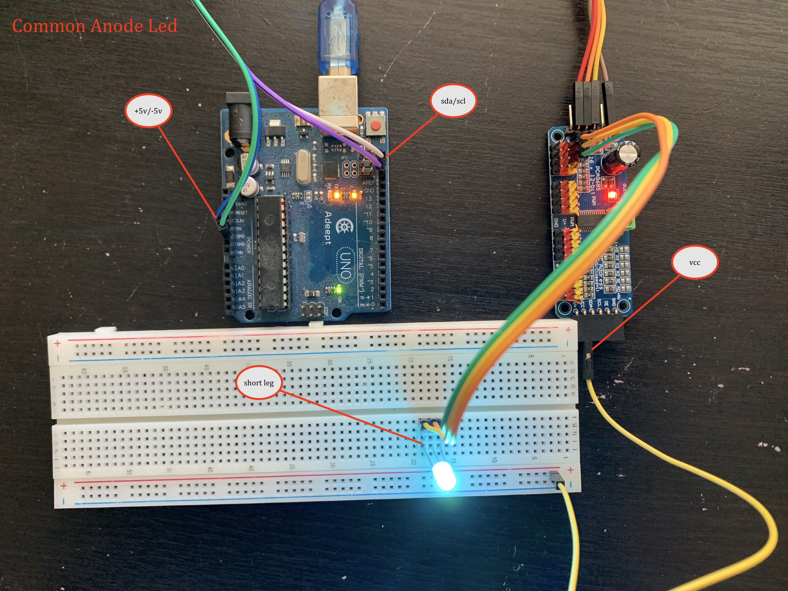

# Pca9685 Common Annod Cathod Led Testing Sample 

----

## connection details 

* connect sda and scl from arduino to pca9685 sda and scl 
* connect the +5v and -5v from arduino to the pac9685 vcc and gnd 

### for common anode 
* take the pin 0...n yellow pin from pca9685 board and connect to the short legs of common anode led 
* take the vcc from the other end of the pca9685 and connect to the long leg of the common anode led 

### for common cathod 
* take the pin 0...n yellow pin from pca9685 board and connect to the long legs of common cathod led 
* take the vcc from the other end of the pca9685 and connect to the long leg of the common anode led 