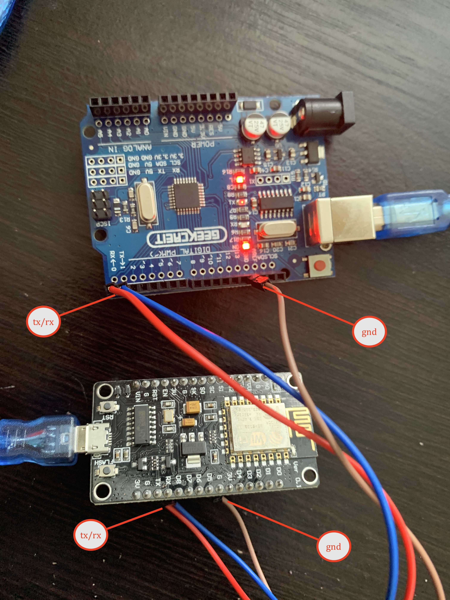

# JMRI MQTT DATA TRANSFORMER APPLICATION 

> Jmri will push the data to the mqtt topic \
> spring transformer application configured with nodes and its details like no of turnout, no of signals, no of light in the node \
> transformer application will read the data from mqtt topics which is pushed by jmri and transform that data node wise  \
> and push back to the mqtt for specific nodes, also store data in end points cache if enabled for serving data via rest endpoints  \
> node wise topics for each esp8266 node will have only relevant data\
> this will reduce the processing on the esp8266 so that it can handle node specific data properly. \
> esp8266 will read data from mqtt nodewise topic or can direclty make http rest endpoint call to spring application and get the data \
> esp8266 will pass the data to the arduino uno/mega via serial line and arduino will do the rest for signals, turnouts, or lights \

### ASSUMPTIONS 
* ALL LIGHTS WILL START FROM 1000 ONWARDS 
* ALL TURNOUT WILL START FROM 10000 ONWARDS 
* ALL 2LED SIGNAL WILL START FROM 20000 ONWARDS 
* ALL 3LED SIGNAL WILL START FROM 30000 ONWARDS 


### CONFIGURATIONS STEPS 
* java 8 runtime installation 
* Mqtt installation and start see [MQTT SETUP GUILDE LINK ](MQTT-SETUP-README.md)
* jmri installation and configured with mqtt see [JMRI MQTT CONNECTION SETUP AND TESTING ](JMRI-MQTT-SETUP-README.md)
* spring data transformation application installation and execution details see [SPRING TRANSFORMATOIN APPLICATION ](spring-jmri-mqtt-data-transformer/README.md)
* reading data after transformaton see below section 

---


### ESP code 

* for reading data directly via mqtt topic using esp8266 
	* [link for configuraiton and deplayment and setup ]()		
* for reading data from the rest service of the spring transformer application 
	* [link for configuraiton and deplayment and setup ]()		

### ARDUINO code
* forwarding data to arduino with servo turnout configuration 
	* [link for configuraiton and deplayment and setup ]()		
* forwarding data to arduino with relay switich snap turnout configuraion 
	* [link for configuraiton and deplayment and setup ]()		 

---

### ESP code 
* configuraing the sensros for block occupancy 
	* direclty publishing data to the MQTT topic 
		* [link for configuraiton and deplayment and setup ]()		
	* publishing data to the spring transforer application via rest endpoints 
		* [link for configuraiton and deplayment and setup ]()		

### ARDUINO code 		
* configuring ir sensor based block decection arduino node 
	* [link for configuraiton and deplayment and setup ]()		
* configuring ct sensor based block decection arduino node 		
	* [link for configuraiton and deplayment and setup ]()		

----

### [MQTT SETUP GUILDE LINK ](MQTT-SETUP-README.md)


### [JMRI MQTT CONNECTION SETUP AND TESTING LIGHT SIGNAL TURNOUT SENSORS ](JMRI-MQTT-SETUP-README.md)


### [SPRING TRANSFORMATOIN APPLICATION SETUP AND EXECUTION ](spring-jmri-mqtt-data-transformer/README.md)


### Connection details from esp to the arduino 
```
conect the gnd from arduino to the -ve line of the breadboard 
take nodemcu/esp8266 connect the gnd/-ve from breadboard to the gnd of the nodemcu/esp8266
take the tx pin of the nodemcu/esp8266 and connect to the rx pin of the arduino 
take the rx pin of the nodemcu/esp8266 and connect to the tx pin of the arduino 

```

