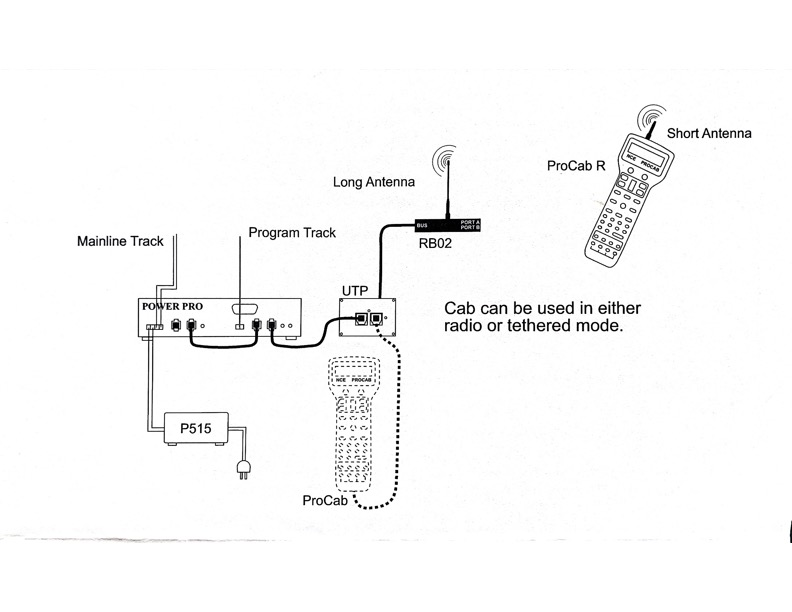
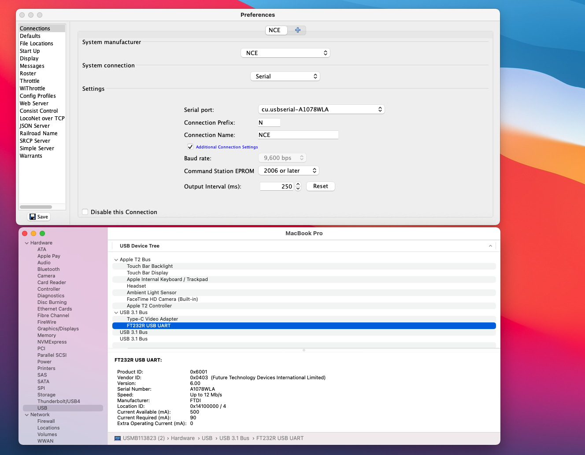
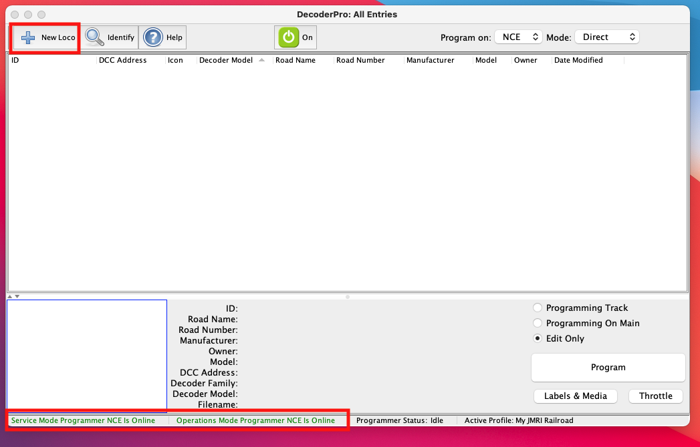
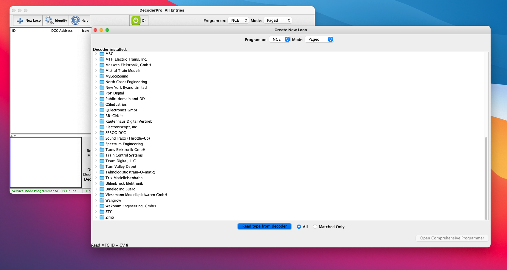
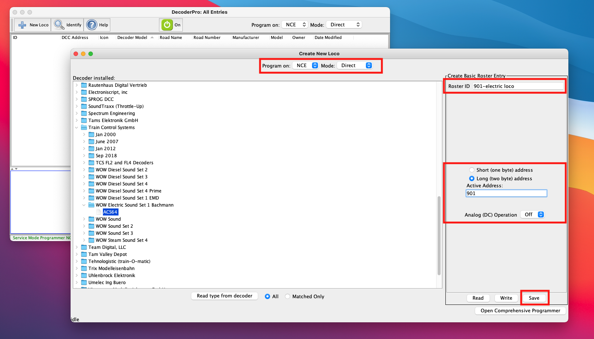
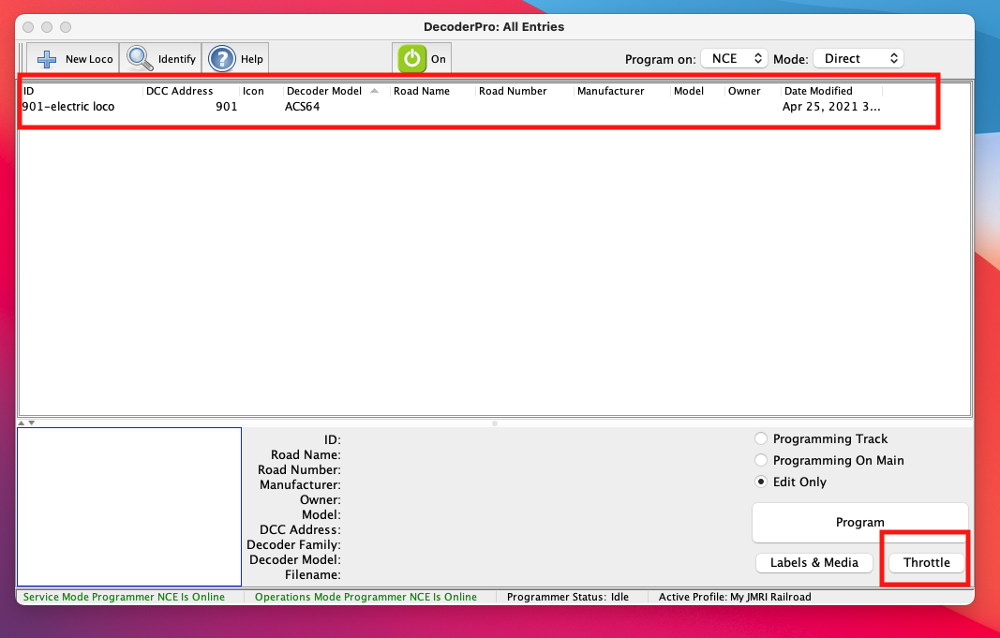
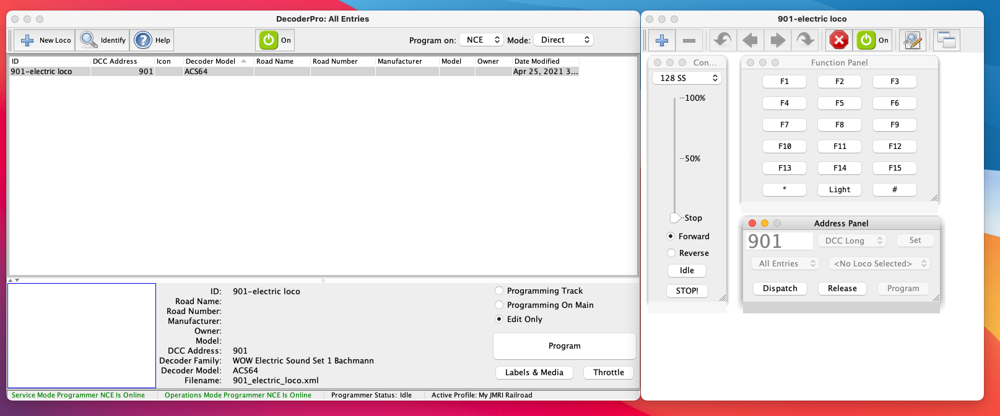
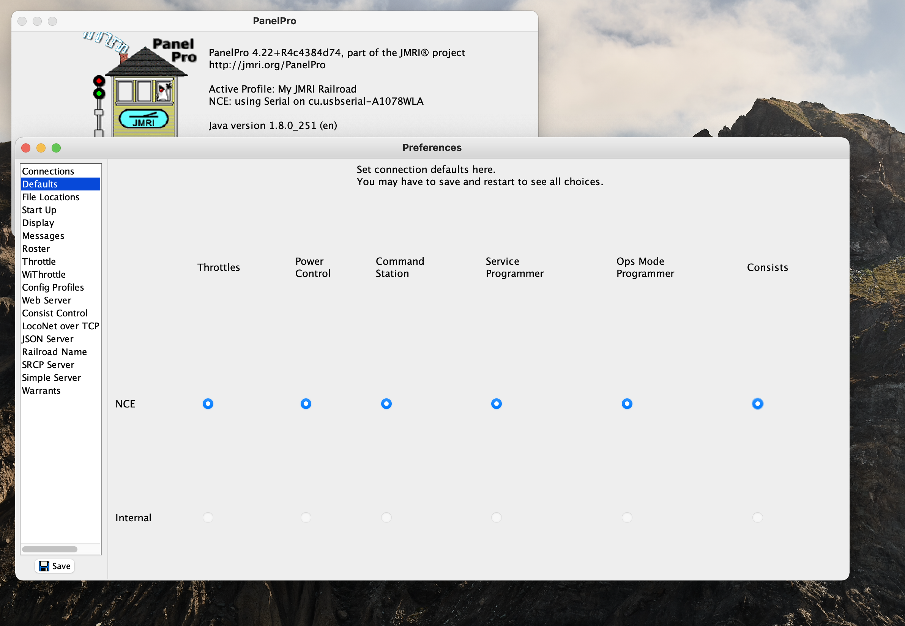

# JMRI-NCE-POWER-PRO

---

## setting up the wireless nce system



```
Use the "Mac_OSX_VCP_Driver.zip" driver for mac os to show in system information 
```



## Adding loco 
```
ensure the service mode programer Nce is online in botton in green color 
place the loco on the programming track and click on add new loco button 
```

```
program on NCE and Mode Direct 
click on read tupe from decoder 
```



```
provodide the roster id and long address and click on save 

```



```
newly added loco will show in roster select the loco and click on throttle button 
move to the loco the normal track from programming track 

```


```
click on the on button on the throrrle and use the functionf to control the loco 

```


```
Decoder/Panel Pro All Entries screen go to:  Edit / Preferences /  Defaults.

all of the selections MUST BE set to NCE not internal. correct them as needed then click save.

exit out of JMRI, close out everything running, and reboot your PC

```
